# EV Legal Radar V1.1

**AI-assisted regulatory intelligence and preliminary legal-review workflow prototype**

EV Legal Radar is a LegalTech prototype exploring how AI can support regulatory monitoring and preliminary legal review while preserving source traceability, human oversight, and clear boundaries between verified legal information and model-generated analysis.

The system does **not** provide legal advice, certify compliance, or make autonomous legal conclusions. Its AI outputs are preliminary research artifacts that remain subject to human legal verification.

> **Design principle:** AI assists with triage and research; humans remain responsible for legal judgment.

| **Source Grounding** | **FACT / INFERENCE Separation** | **Verified Legal Authority** | **Human Review** |
|---|---|---|---|
| Exact source and document quotations | Source facts remain distinct from preliminary analysis | Citations come from a controlled local knowledge base | AI output can be accepted, edited, rejected, or reset |

## Project Overview

The project demonstrates two connected workflows:

1. **Regulatory intelligence** — retrieve official-source metadata on demand, create an unreviewed regulatory event, analyze the retrieved official source, map potential business impact, and generate review tasks.
2. **Document review** — carry a selected task into a TXT document review, run either local rule-based screening or AI-assisted preliminary review, and separate document evidence from verified legal authority and AI analysis.

V1.1 focuses on legal-governance controls around the regulatory-impact stage. The application distinguishes source facts from analytical inferences, validates official-source quotations, restricts legal citations to a local verified knowledge base, and exposes human review controls before generated analysis is relied upon in the workflow.

## Why I Built This

I developed EV Legal Radar from the perspective of a law student interested in AI compliance and technology-sector legal work. The project began with one question:

> **How can generative AI assist legal teams without turning uncertain model output into seemingly authoritative legal conclusions?**

That question shaped the product and engineering choices throughout the prototype. Instead of optimizing for automated legal judgment, EV Legal Radar focuses on source grounding, visible uncertainty, controlled legal authority, and human review. Its purpose is to help structure research and generate review work rather than a final compliance verdict.

## Problem Statement

Regulatory monitoring and legal review are often disconnected. Finding a publication is only the beginning: a reviewer still needs to determine what the source says, which activities may be affected, what documents and facts require examination, and which questions need qualified legal judgment.

Generic AI output can make that process harder to audit when it blends source text, legal authority, assumptions, and conclusions. EV Legal Radar tests a more controlled design:

- retrieve regulatory material from a defined official source;
- preserve the distinction between detected metadata and reviewed legal content;
- require AI statements to reference grounded source evidence;
- label factual summaries separately from preliminary inferences;
- permit only verified, allowlisted legal authorities;
- generate review work rather than a final compliance verdict; and
- keep a human reviewer responsible for accepting, editing, or rejecting the result.

## Core Workflow

```text
Official Regulatory Sources
        ↓
Regulatory Monitoring
        ↓
Preliminary AI Impact Analysis
        ↓
Affected Business Activity Mapping
        ↓
Review Task Generation
        ↓
Human Review
```

### 1. Official Regulatory Sources

The monitoring MVP uses one configured public source: the China National Internet Information Office (`中国网信网`) regulatory listing. Source URLs are restricted to the configured CAC hostnames. Existing portfolio records outside this source flow are clearly presented as demo data unless the repository contains verified source metadata.

### 2. Regulatory Monitoring

Retrieval is user-triggered rather than continuous. The server fetches the configured listing, parses publication metadata, applies a visible keyword filter, and returns matching items as **Source detected**. Detection does not itself establish legal relevance, verify a legal proposition, or assign an impact level.

The user can convert a detected item into an **Unreviewed** regulatory event. At this boundary, the application intentionally creates no impact conclusion, affected activity, suggested document, or review task.

### 3. Preliminary AI Impact Analysis

For a source-detected event, the server retrieves the official detail page and sends the controlled event metadata, official-source material, and eligible verified authority metadata to the OpenAI Responses API. Structured output is used for:

- a new-source summary;
- preliminary interpretation;
- an explainable impact-priority assessment;
- official-source evidence;
- potentially affected activities;
- suggested documents; and
- proposed review tasks.

When no verified previous version is supplied, the application summarizes the new source and does not claim that a particular legal requirement has changed.

### 4. Affected Business Activity Mapping

Potentially affected activities are presented as cautious research inferences, each tied to retained official-source evidence and accompanied by any verified legal basis available to that item. They are not assertions about a specific company's actual operations.

### 5. Review Task Generation

Review tasks are created only after the server returns a valid impact-analysis result. Each generated task includes an objective, legal topic, suggested document, priority, source-evidence provenance, and verified legal basis where available. Tasks can be expanded, moved between local statuses, and linked to Document Review.

### 6. Human Review

AI-generated interpretations, impact factors, activity mappings, suggested documents, and tasks expose browser-local **Accept**, **Edit**, **Reject**, and **Reset** controls. Acceptance means only that a human has reviewed the item; it does not make the item legally verified. Review state is not persisted.

## Legal AI Governance Design

### Source grounding

The project implements two distinct grounding boundaries:

- **Regulatory-impact evidence** must be an exact, contiguous quotation from the retrieved official-source material.
- **Document-review evidence** must be an exact, contiguous quotation from the uploaded document.

Validation permits only harmless formatting normalization such as line-ending, line-wrap, and repeated-whitespace differences. It does not use semantic similarity to approve paraphrases or passages assembled from separate locations.

For regulatory impact analysis, ungrounded quotations are never displayed as verified evidence. A single invalid quotation is excluded deterministically; dependent references are removed, and affected `FACT` factors are downgraded to `INFERENCE` when grounded support remains. If no usable core evidence remains, the server returns a safe `Further Review Required` state with no affected activities, suggested documents, or generated tasks.

### FACT vs INFERENCE distinction

The regulatory-impact UI marks grounded source summaries and quotations as **FACT** and analytical interpretation, possible business effects, suggested review materials, and review tasks as **INFERENCE**. An impact level is expressly a review-priority signal—not a finding that conduct is lawful or unlawful.

### Legal-basis verification

Legal authority is resolved server-side from a local provision-level knowledge base and explicit rule/issue mappings. Only records marked `verificationStatus: "verified"` may be returned as authority. The model supplies allowlisted provision IDs; the server reconstructs the citation and provenance metadata.

The current local registry contains 14 provision summaries from two PRC instruments:

- Personal Information Protection Law of the People's Republic of China — Articles 6, 7, 13, and 14.
- 汽车数据安全管理若干规定（试行） — Articles 3, 4, 5, 6, 7, 8, 9, 10, 11, and 17.

These are curated provision summaries and source metadata, not a complete statutory corpus. If an issue lacks sufficiently specific verified authority, the application uses `LEGAL_SOURCE_NOT_VERIFIED` rather than forcing or inventing a citation.

### Structured-output validation

Both AI workflows use the OpenAI Responses API with `responses.parse()` and `zodTextFormat()`. Server validation checks more than JSON shape, including:

- required fields, enums, counts, and object strictness;
- source-event identity and allowed official host;
- canonical review-rule identity;
- evidence IDs and exact source/document grounding;
- verified and issue-appropriate legal-authority IDs;
- FACT/INFERENCE evidence relationships;
- prior-version comparison boundaries; and
- prohibited definitive compliance conclusions.

A machine-readable response that fails these controls is not silently presented as valid analysis.

### Human-in-the-loop review

AI findings are marked as requiring human review. A reviewer can accept, edit, reject, or reset individual regulatory-impact items and see an aggregate review summary. Original AI text remains visible when an item is rejected, supporting a basic audit-oriented presentation within the current browser session.

The human reviewer remains responsible for source checking, applicability, factual investigation, interpretation, materiality, and any final legal conclusion.

### Failure and degradation handling

- Missing API configuration, authentication errors, rate limits, model availability issues, network/provider failures, timeouts, and validation failures return controlled client messages without exposing secrets or stack traces.
- Unsupported legal authority and unverified prior-version comparisons can trigger one bounded validation-guided retry.
- Prohibited definitive conclusions receive one server-side repair attempt limited to the offending fields, followed by the same full validation pipeline.
- Ungrounded regulatory-source quotations are handled deterministically instead of rerunning the entire analysis, reducing serverless timeout risk without accepting fabricated evidence.
- If repaired or retried output still fails, the analysis is rejected and no impact results or tasks are created.

## Demo / Screenshots

The placeholders below follow the end-to-end portfolio demonstration: detection, preliminary analysis, task generation, and document review.

### Regulatory Update Radar

> **Screenshot placeholder** — On-demand official-source monitoring, source-detected items, and demo review events.

### Preliminary Impact Analysis

> **Screenshot placeholder** — FACT/INFERENCE labels, explainable impact factors, grounded official-source quotations, verified legal authority, and human-review controls.

### Generated Review Tasks

> **Screenshot placeholder** — Task status, review questions, suggested documents, provenance, and the Review Document workflow action.

### AI-assisted Document Review

> **Screenshot placeholder** — Exact document evidence, verified legal authority, preliminary analysis, suggested revision, confidence, and Human Review Required.

## Key Features

### Regulatory Update Radar

- On-demand retrieval from one configured CAC regulatory listing.
- Transparent relevance-keyword matching and source metadata display.
- Deterministic URL-based identifiers and browser-session deduplication.
- Clear separation between `Source detected`, `Unreviewed`, demo, analysis, and verification states.
- Filterable demo and source-detected review-event feed.

### Preliminary Regulatory Impact Analysis

- Server-side retrieval of the selected official source page.
- OpenAI Structured Outputs constrained by a strict Zod schema.
- New-source summary without fabricating an earlier legal position.
- Explainable priority factors using `High`, `Medium`, `Low`, or `Further Review Required`.
- Separate official-source evidence, preliminary interpretation, affected activities, suggested documents, and review tasks.
- Evidence-grounding status shown as verified, partially verified, or unavailable.

### Review Tasks and Workflow Context

- Practical review tasks generated from validated impact analysis or existing demo review items.
- Local task statuses: `Not Started`, `In Review`, and `Completed`.
- Expandable review questions and suggested-document lists.
- **Review Document** action that carries regulation, event, task, topic, suggested document, and priority metadata into Document Review.
- Workflow context is navigation metadata only; it cannot become document evidence or legal authority.

### Document Review

- Preset demo review plus browser-local `.txt` upload and preview.
- File metadata and complete text preview using `FileReader`.
- Eight rule-based review items focused on notice-related issues in the current automotive-data scenario.
- Local keyword/text-pattern review and optional AI-assisted review.
- Three non-conclusive result states: `Found`, `Potential Gap`, and `Further Review Required`.
- Separate presentation of exact document evidence, verified legal authority, preliminary analysis, drafting suggestions, next steps, confidence, and human-review requirement.

### Local and Serverless Operation

- Express development server with Vite `/api` proxy support.
- Equivalent production endpoints through thin Netlify Function adapters.
- Shared HTTP handlers and service logic across local and Netlify environments.
- API keys and optional model configuration remain server-side.

## System Architecture

```mermaid
flowchart LR
    Reviewer["Human legal reviewer"] --> UI["React / Vite UI"]

    UI -->|"On-demand fetch"| UpdatesAPI["Regulatory Updates API"]
    UpdatesAPI --> CAC["Configured CAC official source"]
    CAC --> Detected["Source-detected metadata"]
    Detected --> Event["Unreviewed regulatory event"]

    Event -->|"Explicit analysis request"| ImpactAPI["Regulatory Impact API"]
    ImpactAPI --> SourceFetch["Official detail-page retrieval"]
    ImpactAPI --> ImpactAI["OpenAI structured impact analysis"]
    KB["Verified local legal knowledge base"] --> ImpactAPI
    SourceFetch --> ImpactAI
    ImpactAI --> ImpactValidation["Schema + source grounding + citation + conclusion validation"]
    ImpactValidation --> Impact["Preliminary impact + activities + review tasks"]
    Impact --> Reviewer

    Impact --> Task["Selected review task"]
    Task --> DocUI["Document Review context"]
    DocUI --> FileReader["Browser-local TXT reading"]
    FileReader --> Rules["Local rule-based review"]
    FileReader -->|"Explicit AI request"| ReviewAPI["AI Document Review API"]
    KB --> ReviewAPI
    ReviewAPI --> ReviewAI["OpenAI structured document review"]
    ReviewAI --> ReviewValidation["Schema + exact document evidence + authority validation"]
    ReviewValidation --> Finding["Preliminary findings for human review"]
    Finding --> Reviewer
```



### Runtime boundaries

| Layer | Responsibility |
|---|---|
| React frontend | Navigation, demo data, local task/review state, TXT reading, rule-based review, and result presentation. |
| Shared contracts | Schema versions, supported statuses, evidence types, and workflow constants. |
| Express server | Local development API using the same shared request handlers as production. |
| Netlify Functions | Thin production adapters for monitoring, impact analysis, and document review. |
| Server services | Official-source retrieval, OpenAI calls, structured parsing, validation, legal-authority resolution, and safe error mapping. |
| Local legal knowledge base | Verified provision metadata and controlled issue-to-authority mappings. |
| OpenAI | Generates constrained preliminary analysis only after an explicit user action. |

### API endpoints

| Capability | Local development | Netlify production |
|---|---|---|
| AI-assisted document review | `POST /api/ai-review` | `POST /.netlify/functions/ai-review` |
| Regulatory monitoring | `GET /api/regulatory-updates` | `GET /.netlify/functions/regulatory-updates` |
| Preliminary impact analysis | `POST /api/regulatory-impact-analysis` | `POST /.netlify/functions/regulatory-impact-analysis` |

The frontend selects the appropriate endpoint by environment. No OpenAI secret is included in a `VITE_*` variable or client request.

## Tech Stack

| Technology | Use in this project |
|---|---|
| React 19 | Workflow UI and browser-local state. |
| Vite 8 | Development server, API proxy, and production build. |
| Node.js + Express 5 | Local backend and reusable HTTP service boundary. |
| Netlify Functions | Production serverless API adapters. |
| OpenAI Node SDK 7 | Server-side Responses API and Structured Outputs. |
| Zod 4 | Model schemas, normalized result contracts, and response validation. |
| Undici | Optional environment-driven proxy transport for local OpenAI access. |
| Node test runner | Governance, grounding, mapping, retry, workflow, and deployment tests. |
| Oxlint | Static lint checks. |

## Running Locally

```bash
npm install
cp .env.example .env
npm run dev:all
```

Configure your own server-side values in the ignored local `.env` file:

```dotenv
OPENAI_API_KEY=
OPENAI_MODEL=gpt-5.4-mini
```

- Frontend: Vite's default local URL, normally `http://localhost:5173`
- Backend: `http://localhost:3001`
- `npm run dev` or `npm run dev:client`: frontend only
- `npm run dev:server`: backend only

An API key is required only for the two AI-assisted analysis actions. Demo views, TXT preview, and local rule-based document review remain available without it. AI-assisted analysis sends the relevant source or uploaded text to OpenAI after the user explicitly starts the request.

### Quality checks

```bash
npm test
npm run lint
npm run build
```

Additional architecture and interview-demo notes are available in [`docs/ARCHITECTURE.md`](docs/ARCHITECTURE.md) and [`docs/DEMO_GUIDE.md`](docs/DEMO_GUIDE.md).

## Current Limitations

- This is a portfolio and workflow prototype, not a production legal/compliance platform.
- Monitoring is user-triggered and limited to the first page of one configured CAC listing; it is not continuous, scheduled, or multi-jurisdictional monitoring.
- Keyword matching identifies potentially relevant titles but does not determine legal relevance or impact.
- Browser-side deduplication, task progress, human-review records, uploaded documents, and results are held in memory and reset on reload.
- The dashboard counts and several regulatory update/change records are demonstration data, not a live measure of current regulatory coverage.
- The system does not assert a before/after legal change unless a verified previous version is supplied. The current live source-detected flow uses a new-source summary.
- The verified knowledge base contains only 14 provision summaries from two PRC legal instruments; it is not a complete source of law.
- Document review is limited to `.txt` files and eight notice-related prototype rules. PDF and DOCX parsing are not implemented.
- Rule-based review is keyword/text-pattern screening and cannot reliably interpret context.
- AI-assisted analysis depends on an external model and may still be incomplete or incorrect despite the implemented controls.
- AI document review sends uploaded text to OpenAI only after explicit user action; the prototype is not suitable for confidential production documents without additional privacy and security assessment.
- The application has no authentication, role-based access, database, durable audit log, document encryption layer, or formal matter-management controls.
- Netlify monitoring deduplication is not durable server-side; no database is used.
- No output determines whether a real organization, document, system, or activity is legally compliant.

## Future Development

- Expand the verified legal knowledge base and maintain provision-level source provenance.
- Add controlled monitoring for additional official sources and jurisdictions.
- Introduce persistent source history, deduplication, review records, and an auditable approval workflow.
- Support verified regulatory version comparison and source-level change detection.
- Add PDF and DOCX ingestion with secure document-handling controls.
- Develop reviewer annotations, matter ownership, permissions, and exportable review records.
- Build evaluation datasets for citation accuracy, evidence grounding, cautious-language compliance, and task usefulness.
- Add production security controls, retention policies, authentication, and privacy review before handling confidential materials.

## Disclaimer

EV Legal Radar is an educational and portfolio LegalTech prototype. It is intended only to demonstrate AI-assisted regulatory research, workflow design, and preliminary legal-review controls. It does not provide legal advice, determine legal rights or obligations, certify legal compliance, or replace review by a qualified legal professional. AI-generated content may be incomplete or inaccurate and must be checked against official sources, complete business facts, and applicable law by a human legal reviewer.
