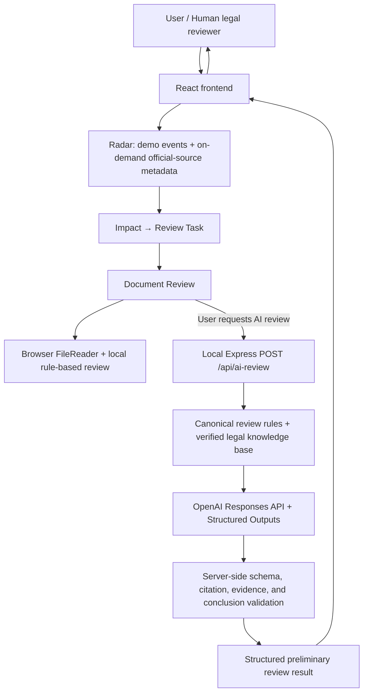

# EV Legal Radar

**AI-assisted Regulatory Intelligence & Preliminary Legal Review Prototype**

EV Legal Radar is an educational portfolio prototype that connects regulatory research with a preliminary compliance-review workflow. It helps a legal intern or junior legal professional move from a demo regulatory event to an impact assessment, review task, document review, grounded evidence, verified legal authority, and an AI-assisted preliminary finding. It is not an autonomous legal decision-making system and does not provide legal advice.

## Why This Project

Regulatory updates are often tracked separately from the internal work required to understand their practical effect. A legal professional may identify a new rule, but still needs to determine which activities could be affected, what facts remain unknown, which documents should be reviewed, and which conclusions require a qualified lawyer.

EV Legal Radar demonstrates an end-to-end workflow:

`Regulatory Update → Impact Assessment → Review Task → Document Review → Evidence Extraction → Verified Legal Authority → AI-assisted Preliminary Analysis → Human Review`

This pattern is relevant to in-house legal teams, privacy and data-compliance work, and AI-enabled legal operations because it treats AI output as one controlled step inside a broader legal workflow—not as a substitute for legal judgment.

## Core Workflow

1. **Regulatory Update Radar** — Displays locally defined demo change events and supports on-demand retrieval of listing metadata from one official China National Internet Information Office source. Retrieved items are labelled `Source detected`; retrieval occurs only when the user clicks the fetch action.
2. **Regulatory Impact Assessment** — Shows a preliminary impact level, potentially affected activities, suggested documents, and generated review tasks. Impact is a workflow-priority indicator, not a legal conclusion.
3. **Review Task generation and context** — Existing regulatory-review items are converted into local review tasks with questions, suggested documents, status, risk/priority, and a reason for review. Task status and checked questions use React state and are not persisted.
4. **Document Review linkage** — A task can open the Document Review module with workflow metadata such as the related regulation, task, topic, suggested document, and impact level. This metadata is not treated as document evidence or legal authority.
5. **Local TXT upload** — The browser reads and previews a selected `.txt` file with `FileReader`. File selection, preview, and rule-based analysis remain local to the browser.
6. **Rule-based preliminary review** — Eight locally defined rules use keyword and text-pattern matching to identify potentially relevant passages. Results are limited to `Found`, `Potential Gap`, or `Further Review Required`.
7. **AI-assisted review through the local backend** — When the user explicitly requests AI review, the uploaded text, canonical review rules, and verified source metadata are sent through the local Express backend to the OpenAI Responses API. The server keeps the API key out of frontend code.
8. **Document evidence grounding** — AI evidence must be one contiguous verbatim passage from the uploaded document. Only harmless whitespace and line-ending differences are normalized. Paraphrased or spliced evidence is rejected.
9. **Verified legal authority mapping** — Legal authority is resolved from a local verified knowledge base and an explicit rule-to-authority allowlist. The model returns authority IDs, while the server reconstructs the citation metadata.
10. **Human review requirement** — AI findings include confidence, recommendations, next checks, and `Human Review Required`. They remain preliminary and require professional review against complete facts.

## AI-assisted Review Design

Each AI-assisted finding separates five different concepts:

### Document Evidence

What the uploaded document actually says. Evidence must be copied from the document rather than paraphrased, translated, or assembled from separate passages. If no exact supporting passage exists, the result uses an explicit no-evidence state.

### Legal Authority

Only provisions present in the project's verified local legal knowledge base and mapped to the specific review rule may appear. Legal authority cards show the law, article, issuing authority, official URL, verification status, and a short stored requirement summary. If no sufficiently verified mapping exists, the result uses `LEGAL_SOURCE_NOT_VERIFIED`.

### AI Analysis

The model provides a cautious preliminary comparison between the grounded document evidence, the review rule, and the supplied authority. It is instructed not to invent company facts, legal provisions, or definitive legal conclusions.

### Recommendation / Next Check

The result can suggest a generic drafting improvement or a factual/documentary follow-up. These are review aids—for example, checking a data inventory or comparing a notice with actual product behavior—not findings about a real company.

### Confidence and Human Review Required

Confidence describes confidence in the preliminary text analysis, not a probability that conduct is legally compliant. AI-assisted results are marked as requiring human review. Absence of evidence in one uploaded document does **not** automatically establish legal non-compliance.

## Legal Grounding and Guardrails

The implemented guardrails include:

- The server replaces frontend rule objects with rules from its canonical local registry.
- Legal citations must match the provision IDs allowlisted for the specific review rule.
- Only knowledge-base records with `verificationStatus: "verified"` can be resolved as legal authority.
- Regulation-level metadata does not authorize the model to cite the same article for every issue.
- AI document evidence must be an exact contiguous quotation from the uploaded text, subject only to conservative layout normalization.
- The OpenAI response uses Structured Outputs generated from a Zod schema.
- The server validates schema shape, rule count and identity, risk level, citation IDs, evidence grounding, and prohibited definitive conclusions.
- Invalid or unsupported output is rejected. Selected validation failures can trigger one validation-guided retry before the request fails.
- Safe diagnostics record structural information rather than the API key or full uploaded document.
- Legal authority and document evidence are displayed in separate UI sections.
- AI analysis is expressly preliminary and remains subject to human legal review.

These controls reduce specific failure modes, but they do not guarantee legal accuracy, information security, or regulatory compliance.

## Current Verified Legal Knowledge Base

The local registry currently contains the following 14 provision records. The descriptions below summarize the fields actually stored in [`src/data/legalKnowledgeBase.js`](src/data/legalKnowledgeBase.js); the project does not store complete statutory texts.

| Statute / regulation | Article | Jurisdiction | Stored coverage summary |
|---|---:|---|---|
| Personal Information Protection Law of the People's Republic of China | 6 | China | Processing purpose and data minimization. |
| Personal Information Protection Law of the People's Republic of China | 7 | China | Transparency and disclosure of processing purpose, method, and scope. |
| Personal Information Protection Law of the People's Republic of China | 13 | China | Statutory lawful basis for personal-information processing. |
| Personal Information Protection Law of the People's Republic of China | 14 | China | Informed consent and separate or written consent where required. |
| 汽车数据安全管理若干规定（试行） | 3 | China | Automotive-data definitions and classification, including sensitive personal information, important data, and vehicle trajectory data. |
| 汽车数据安全管理若干规定（试行） | 4 | China | Purpose requirements for automotive-data processing. |
| 汽车数据安全管理若干规定（试行） | 5 | China | Data-security obligations; the local summary is intentionally limited. |
| 汽车数据安全管理若干规定（试行） | 6 | China | In-vehicle processing, default non-collection, appropriate precision, and anonymization/de-identification principles. |
| 汽车数据安全管理若干规定（试行） | 7 | China | Disclosure of data categories, collection circumstances, purpose, method, storage location, retention, user rights, and contact information. |
| 汽车数据安全管理若干规定（试行） | 8 | China | Consent or another legally permitted basis for processing personal information. |
| 汽车数据安全管理若干规定（试行） | 9 | China | Heightened review of sensitive personal information, separate consent, vehicle trajectory information, and deletion-related requirements. |
| 汽车数据安全管理若干规定（试行） | 10 | China | Important-data risk assessment and reporting of storage location and retention period. |
| 汽车数据安全管理若干规定（试行） | 11 | China | Important-data localization and cross-border security assessment; it is not mapped automatically to ordinary personal information. |
| 汽车数据安全管理若干规定（试行） | 17 | China | Complaint and reporting channels and handling of user complaints. |

## Technology

- **React 19** — Frontend workflow, local task state, document interaction, and results UI.
- **Vite 8** — Frontend development server, production build, and `/api` development proxy.
- **Node.js and Express 5** — Local backend endpoints at `POST /api/ai-review` and `GET /api/regulatory-updates`.
- **OpenAI Node SDK 7** — Calls the OpenAI Responses API from the backend only.
- **OpenAI Structured Outputs** — `responses.parse()` and `zodTextFormat()` constrain model output.
- **Zod 4** — Validates model output, normalized results, and the API response contract.
- **Undici** — Supplies an explicit `ProxyAgent` when standard HTTP(S) proxy environment variables are configured.
- **dotenv** — Loads local server environment variables.
- **Node test runner** — Executes mapping, citation, evidence-grounding, retry, and workflow tests.
- **Oxlint** — Static linting.
- **Concurrently** — Starts the frontend and backend together for local development.

The browser handles workflow interaction and local TXT reading. The Express server protects the API key, supplies canonical rules and verified authority metadata, calls OpenAI, and validates the result before returning it to React.

## Architecture



See [`docs/ARCHITECTURE.md`](docs/ARCHITECTURE.md) for the legal and technical trust boundaries.

## Project Structure

```text
ev-legal-radar/
├── src/
│   ├── App.jsx                         # Top-level navigation and local workflow state
│   ├── components/                     # Radar, task, document-review, and result UI
│   ├── data/
│   │   ├── regulatoryUpdates.js        # Existing regulatory/demo records
│   │   ├── regulatoryChangeEvents.js   # Demo impact events and generated review tasks
│   │   ├── reviewRules.js              # Eight document-review rules
│   │   ├── legalKnowledgeBase.js       # Verified local provision registry
│   │   └── ruleLegalAuthorityMap.js    # Explicit and conditional rule mappings
│   ├── models/reviewResult.js           # Frontend result contract checks
│   ├── services/aiReviewService.js      # Frontend /api client and response parsing
│   ├── services/regulatoryMonitoringService.js # Frontend monitoring API client
│   └── utils/
│       ├── reviewDocument.js            # Browser rule-based review
│       ├── regulatoryMonitoring.js      # Detected-item deduplication and review conversion
│       └── reviewWorkflow.js            # Task-to-document workflow metadata
├── server/
│   ├── index.js                         # Express endpoint and canonical-input checks
│   ├── data/regulatoryMonitoringConfig.js # Official source and keyword configuration
│   └── services/
│       ├── aiReviewService.js           # OpenAI request, proxy transport, and retry
│       ├── aiReviewValidation.js        # Zod, evidence, authority, and result validation
│       └── regulatoryMonitoringService.js # Official listing fetch, parse, and filter
├── shared/aiReviewContract.js           # Shared enums and API schema version
├── tests/                               # Node tests for grounding, mapping, and workflow
├── docs/
│   ├── DEMO_GUIDE.md
│   └── ARCHITECTURE.md
├── vite.config.js                       # React plugin and /api proxy
└── .env.example                         # Non-secret local configuration template
```

## Running Locally

### 1. Install dependencies

```bash
npm install
```

### 2. Create a local environment file

```bash
cp .env.example .env
```

Add your own API key to the local `.env` file:

```dotenv
OPENAI_API_KEY=
OPENAI_MODEL=gpt-5.4-mini
```

Do not commit the completed `.env`. The repository's `.gitignore` excludes `.env`, `.env.local`, and `.env.*` while allowing `.env.example`.

An API key is required only for AI-assisted review. The Radar, demo view, TXT preview, and rule-based review can run without it.

### 3. Start frontend and backend together

```bash
npm run dev:all
```

- Frontend: `http://localhost:5173` by Vite's default local configuration
- Backend: `http://localhost:3001` by default
- Development API proxy: `/api` → `http://localhost:3001`

The backend port can be overridden with `PORT`. If your local network requires an outbound proxy, the OpenAI client reads standard `HTTPS_PROXY`, `HTTP_PROXY`, `https_proxy`, or `http_proxy` environment variables; no proxy address is hardcoded.

Individual commands are also available:

```bash
npm run dev          # frontend
npm run dev:server   # backend
npm test
npm run lint
npm run build
```

If `OPENAI_API_KEY` is absent, `/api/ai-review` returns an explicit `503` not-configured response.

## Demo Walkthrough

1. Open **Regulatory Update Radar**. Optionally click **获取最新监管动态** to retrieve relevant metadata from the configured official CAC listing. Retrieved cards remain `Source detected` until a user creates an `Unreviewed` review event.
2. For the established workflow, select the China automotive-data **Demo change event**. To demonstrate ingestion boundaries, select **Start Legal Review** on a detected item and confirm that its new review event contains no fabricated impact, obligations, or tasks.
3. Review the preliminary impact assessment, affected activities, and suggested documents.
4. Open the task that suggests reviewing `用户隐私政策`.
5. Click **Review Document**; the Document Review page receives the regulation, task, topic, document type, and priority as workflow metadata.
6. Use the preset **Demo Review** for a static walkthrough, or stay in **Upload Your Document** and select a local `.txt` file.
7. Choose **Rule-based Review** for local keyword matching or **AI-assisted Review** for the backend workflow.
8. Click **Run AI-assisted Review**. This action sends the document text through the local backend to OpenAI.
9. Inspect each exact document-evidence passage.
10. Inspect the separate verified Legal Authority cards or `LEGAL_SOURCE_NOT_VERIFIED` state.
11. Review the preliminary analysis, risk explanation, suggested revision, next check, confidence, and human-review status.
12. Return to the originating review task using the back action.

For a 3–5 minute interview script, see [`docs/DEMO_GUIDE.md`](docs/DEMO_GUIDE.md).

## Limitations

- This is an educational prototype, not a production legal or compliance system.
- Regulatory monitoring is an on-demand metadata fetch from one configured CAC listing page. It does not poll, run on a schedule, cover other jurisdictions, or provide a complete feed of relevant law.
- Source detection uses title-keyword matching only. It does not download full legal text, classify legal effect, verify a provision, or generate impact analysis.
- Detected-item de-duplication is held in frontend React state and resets when the browser application reloads; it is independent of backend restarts.
- The verified local legal knowledge base is limited to 14 provision records from two Chinese legal instruments.
- The application does not contain complete statutory texts or a general-purpose legal research database.
- The document-review checklist contains eight rules focused on notice-related issues in the current automotive-data scenario.
- Local upload supports plain-text `.txt` files only; PDF and DOCX parsing are not implemented.
- Rule-based review relies on simple keywords and text patterns.
- AI-assisted review sends document text to OpenAI only after the user requests it; it is not an offline/local model.
- Tasks, checked questions, uploaded documents, and review results are not persisted to a database.
- Demo Review results are preset demonstration content and are separate from live AI-assisted analysis.
- The system does not determine whether a real company, activity, or document is legally compliant.
- All substantive interpretations and conclusions require human legal review.

## Future Development

The following are possible future directions, not current features:

- Expand and maintain the verified provision-level legal knowledge base.
- Expand controlled ingestion to additional verified official sources and add persistent review/audit state.
- Support PDF and DOCX document review.
- Add regulatory version comparison and change detection.
- Develop more granular obligation and fact-pattern mapping.
- Add an auditable review history, reviewer notes, and approval workflow.
- Explore retrieval-based legal research with source-level provenance.

## Disclaimer

This project is an educational and portfolio prototype. It does not provide legal advice and should not be used as a substitute for professional legal review.
