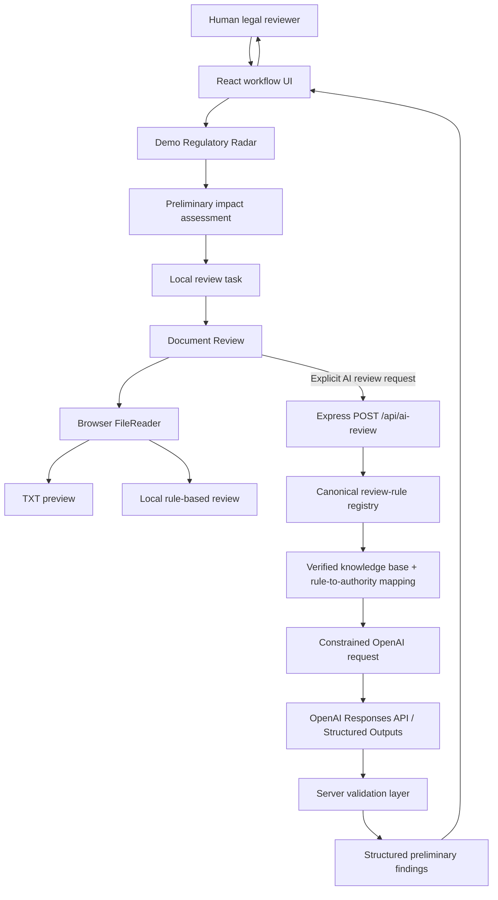

# EV Legal Radar — Technical and Legal Architecture

EV Legal Radar is a local React and Node.js prototype for regulatory workflow demonstration and preliminary document review. Its architecture separates workflow metadata, uploaded-document evidence, verified legal authority, model analysis, server validation, and final human judgment.

## High-level Data Flow



## Frontend

The React frontend provides:

- Regulatory Intelligence and Regulatory Update Radar navigation.
- Demo event cards and regulatory-change detail views.
- Preliminary impact summaries and generated review tasks.
- Local task status and review-question state.
- Task-to-Document Review context transfer.
- Browser-based `.txt` selection, reading, metadata, and preview.
- Rule-based or AI-assisted review-mode selection.
- Separate presentation of document evidence, legal authority, analysis, recommendations, confidence, and human-review status.

`src/App.jsx` owns the main navigation and local workflow state. Review-task progress is held in React state and is lost when the page reloads. `src/utils/reviewWorkflow.js` creates task-navigation metadata while intentionally excluding document text, evidence, and legal-authority objects.

The browser reads the selected file with `FileReader`. File preview and rule-based review remain local. The frontend sends document text to `/api/ai-review` only after the user explicitly requests AI-assisted review.

## Local Backend

The Express backend listens on port `3001` by default and exposes:

```text
POST /api/ai-review
```

The endpoint accepts:

```json
{
  "documentText": "...",
  "reviewRules": [],
  "legalSource": {}
}
```

The backend:

1. Validates the presence and basic shape of the request.
2. Resolves each requested rule against the server's canonical review-rule registry.
3. Rejects rule metadata or authority IDs that do not match the canonical rule.
4. Validates the top-level source metadata against the local verified registry.
5. Reads `OPENAI_API_KEY` only from the server environment.
6. Constructs the OpenAI request with document text, review rules, and rule-specific allowed authorities.
7. Validates and normalizes the model response before returning it to React.

The frontend development server proxies `/api` to `http://localhost:3001`. The backend is a local API-key boundary; it is not a general authentication or production security layer.

## OpenAI Transport and Request Construction

`server/services/aiReviewService.js` uses the official OpenAI Node SDK and the Responses API. `responses.parse()` is configured with `zodTextFormat()` so the model response follows the Zod review schema.

The OpenAI client:

- Reads `OPENAI_API_KEY` from `process.env`.
- Uses `OPENAI_MODEL` when configured and otherwise uses the local default defined in the service.
- Sets `store: false` on review requests.
- Uses an Undici `ProxyAgent` when a standard HTTP(S) proxy environment variable is present.
- Does not log the API key, proxy URL, or complete uploaded document.

The proxy configuration supports the current local development environment but is not a claim that document data remains on the user's device during AI-assisted review.

## Verified Legal Knowledge Base

`src/data/legalKnowledgeBase.js` is the controlled provision registry. Each record includes a provision ID, law ID and name, jurisdiction, article, topic, stored requirement summary, official URL, authority, review scope, and verification status.

Only records with:

```text
verificationStatus: "verified"
```

can be resolved as legal authority.

The current registry contains 14 records from:

- Personal Information Protection Law of the People's Republic of China: Articles 6, 7, 13, and 14.
- 汽车数据安全管理若干规定（试行）: Articles 3, 4, 5, 6, 7, 8, 9, 10, 11, and 17.

The repository stores provision summaries and provenance metadata, not complete official statutory texts.

## Rule-to-authority Mapping

`src/data/ruleLegalAuthorityMap.js` implements the citation allowlist. It maps a review-rule ID to verified provision IDs and supports narrowly defined conditions.

Examples:

- `processing-purpose` receives PIPL Articles 6 and 7 and Automotive Data Provisions Articles 4 and 7.
- `retention-period` receives Automotive Data Provisions Article 7 as a disclosure authority; this does not establish that a particular retention duration is permissible.
- `storage-location` receives Article 11 only when server-trusted context identifies important-data relevance.
- `cross-border-transfer` receives Article 11 only for important-data context, not automatically for ordinary personal information.
- An unmapped or insufficiently verified proposition returns `LEGAL_SOURCE_NOT_VERIFIED`.

The model sees only the authorities resolved for that rule. It returns `legalAuthorityIds`; the server reconstructs the final authority objects. The model cannot add a citation merely because it belongs to the same regulation.

## AI-assisted Preliminary Analysis

The model reviews every supplied rule exactly once and returns:

- Rule ID and review item title.
- `Found`, `Potential Gap`, or `Further Review Required`.
- An explicit evidence state and evidence text.
- Preliminary observation and issue summary.
- Risk reason, suggested revision, and suggested next step.
- Review priority and confidence.
- Allowlisted legal-authority IDs.

The server—not the model—adds the final legal authority metadata, analysis method, and mandatory AI human-review flag.

## Validation Layer

`server/services/aiReviewValidation.js` performs layered checks:

### Structured-output validation

The raw model response must match a strict Zod schema. The result must contain exactly one item for every supplied rule, without duplicate or missing IDs.

### Rule metadata validation

Rule title, issue type, and risk level must match the server-supplied canonical rule.

### Authority validation

Returned authority IDs must exactly match the rule-specific allowlist. Duplicates, missing IDs, borrowed authorities, and model-generated citations are rejected. Final citation metadata is copied from the verified local registry.

### Document-evidence grounding

When `evidenceFound` is true, evidence must be one contiguous passage present in the uploaded document. Validation normalizes only:

- CRLF versus LF line endings.
- Repeated horizontal whitespace.
- Line wrapping.
- Leading and trailing whitespace.

It does not use semantic similarity or fuzzy matching. Paraphrased evidence and text assembled from separate passages fail validation. When no passage exists, `evidenceFound` must be false and evidence must be empty.

### Preliminary-conclusion controls

Analytical fields are checked for prohibited definitive legal/compliance conclusions. The prompt also distinguishes disclosure requirements from substantive lawfulness—for example, disclosure of a retention period does not prove that the stated duration is legally permissible.

### Retry behavior

For supported validation failures, the service generates a correction instruction and makes one complete structured-response retry. Evidence failures identify the affected rule IDs and require an exact replacement quotation or a no-evidence state. The second response must pass the same validation; validation is not bypassed.

## Result Presentation

The frontend result model checks the API schema version, enum values, required strings, human-review flag, and verified authority records before displaying a result.

Each result card separates:

1. **Document Evidence** — the exact reviewed-document passage or no-evidence message.
2. **Legal Authority** — verified local provision cards or `LEGAL_SOURCE_NOT_VERIFIED`.
3. **AI Analysis** — preliminary observation and risk explanation.
4. **Recommendation** — suggested revision and next factual/documentary check.
5. **Confidence and Human Review Required** — interpretation controls, not compliance probabilities.

## Human Reviewer

The human reviewer remains responsible for:

- Confirming the complete factual and technical context.
- Checking whether the reviewed document is complete and current.
- Determining whether other laws or authorities apply.
- Reviewing the stored provision summaries against official sources.
- Assessing legal interpretation, applicability, materiality, and any final conclusion.

The application does not approve, reject, or certify compliance.

## Why This Is Safer Than Accepting a Generic Chat Answer

Compared with sending a document to a general chat interface and accepting the answer directly, this prototype adds traceable constraints:

- A fixed review-rule registry.
- A provision-level citation allowlist.
- Exact document-evidence validation.
- A strict structured-output contract.
- Explicit failure states instead of forced citations.
- Separate evidence, authority, and analysis in the UI.
- Mandatory human review for AI-assisted findings.

These mechanisms make specific errors easier to detect and reject. They do not eliminate model error, replace source checking, or make the prototype suitable for unsupervised legal decisions.

## Data Handling and Persistence

- TXT selection and preview occur in the browser.
- Rule-based review runs in the browser.
- AI-assisted review sends document text through the local backend to OpenAI after explicit user action.
- OpenAI review requests set `store: false` in the SDK request.
- The application has no database.
- Uploaded documents, task progress, and review results are not persisted by the application.
- Real API keys belong only in an ignored local `.env` file.

## Current Scope and Limitations

This is a development and portfolio architecture, not a production deployment. It does not include user authentication, role-based permissions, a database, document encryption controls, audit logging, continuous regulatory monitoring, automated official-source ingestion, or a complete legal corpus. Legal and information-security review would be required before handling confidential production documents.
